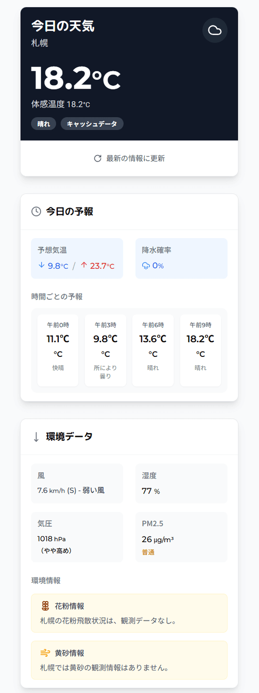

# 今日の天気 - 日本の天気情報アプリ

シンプルで使いやすい日本の天気情報アプリです。札幌の現在の天気、予報、環境データ（PM2.5、花粉、黄砂）をわかりやすく表示します。

## アプリのUI

以下はアプリの見た目です。



## 機能

- リアルタイムの天気情報表示
- 時間ごとの予報
- 最高気温・最低気温の表示
- 降水確率の表示
- 風力・風向き情報（風力階級付き）
- 気圧情報（気圧傾向付き）
- PM2.5情報（健康影響度付き）
- 花粉情報
- 黄砂情報
- レスポンシブデザイン（モバイルフレンドリー）
- データキャッシング機能

## 技術スタック

- フロントエンド: React + Vite
- スタイリング: Tailwind CSS + shadcn/ui
- データ取得: React Query
- サーバーサイド: Express (開発環境) / Netlify Functions (本番環境)
- 天気データ: WeatherAPI
- AI生成: Google Gemini API
- 環境データ: Brave Search API

## Netlifyへのデプロイ方法

このアプリケーションはNetlifyに簡単にデプロイできます：

1. Netlifyアカウントにログインします
2. 「新しいサイトをGitからインポート」を選択
3. GitHubリポジトリを連携してこのリポジトリを選択
4. ビルド設定を確認します:
   - ビルドコマンド: `npm run build`
   - 公開ディレクトリ: `dist`
   - 関数ディレクトリ: `netlify/functions`

5. 環境変数を設定します:
   - `WEATHERAPI_KEY` - WeatherAPIのAPIキー
   - `BRAVE_SEARCH_API_KEY` - Brave Search APIのAPIキー
   - `GOOGLE_API_KEY` - Google Gemini AIのAPIキー

6. デプロイボタンをクリックして、サイトをデプロイします

## ローカル開発

```bash
# 依存関係のインストール
npm install

# 開発サーバーの起動
npm run dev

# ビルド
npm run build

# ビルドプレビュー
npm run preview
```

## 環境変数

`.env.example`ファイルを`.env`にコピーして、必要なAPIキーを設定してください：

```
WEATHERAPI_KEY=your_weatherapi_key
BRAVE_SEARCH_API_KEY=your_brave_search_api_key
GOOGLE_API_KEY=your_google_gemini_api_key
```

## ライセンス

MIT
